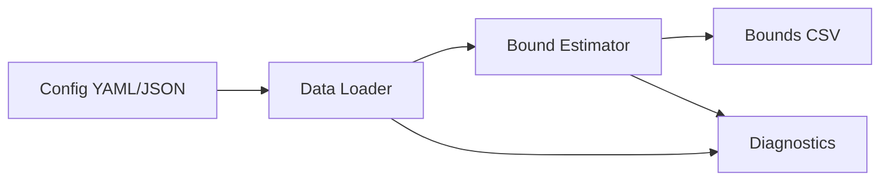
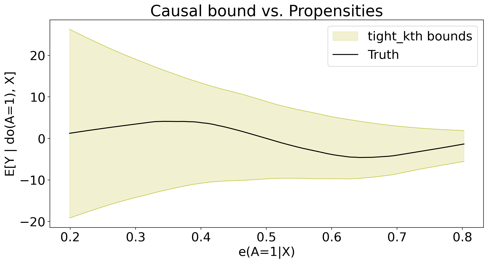

# Data-Driven Information-Theoretic Causal Bounds under Unmeasured Confounding

This repo implements the method in "Data-Driven Information-Theoretic Causal Bounds under Unmeasured Confounding (Jung & Kang, 2026)." It provides data-driven lower and upper bounds on causal estimands under unmeasured confounding without bounded outcomes, sensitivity parameters, instruments/proxies, or full SCM specification.

Target estimands (paper notation):

```
θ(a, x) = E_{Q_{a,x}}[φ(Y)],  Q_{a,x} = P(Y | do(A=a), X=x)
θ(a)    = E_{Q_a}[φ(Y)]
```

## Install

From the repo root:

```bash
pip install .
```

For development installs:

```bash
pip install -e .
```

Optional extras for figure reproduction:

```bash
pip install .[experiments]
```

## Python API

New wrapper (recommended):

```python
import itbound
```

Legacy import (still supported):

```python
import fbound
```

## CLI

### Run bounds from config

```bash
itbound run --config docs/cli-config.example.yaml
```

You can override output path:

```bash
itbound run --config docs/cli-config.example.yaml --out /tmp/itbound_bounds.csv
```

### Run a quick synthetic example

```bash
itbound example --out /tmp/itbound_example.csv
```

### Reproduce arXiv plots

```bash
itbound reproduce --dry-run
```

Notes:
- `reproduce` expects the final-arxiv JSON summaries under `experiments/final-arxiv`.
- If you installed the package, run `itbound reproduce` from the repo root so the data files are found.
- Install extras first: `pip install .[experiments]`.

## Good Example (End-to-End)

Install, run a quick example, and verify the output columns:

```bash
pip install .
itbound example --out /tmp/itbound_example.csv

python - <<'PY'
import pandas as pd
df = pd.read_csv("/tmp/itbound_example.csv")
print(df.columns.tolist())
PY
```

Expected columns include `lower` and `upper`.

## Example Diagram



## Example Plot



## Config schema (CLI)

The config must be YAML or JSON and include:

- `data`: one of `synthetic`, `npz_path`, or `csv_path`
- `divergence`
- `propensity_model`
- `m_model`
- `dual_net_config`
- `fit_config`
- `seed`

Optional:
- `phi` (default: `identity`)
- `output_path` (default: `itbound_bounds.csv`)

See `docs/cli-config.example.yaml` for a complete example.

## Toy CSV example

Create a toy CSV and run:

```bash
python - <<'PY'
import numpy as np
import pandas as pd

rng = np.random.default_rng(0)
n = 50
x1 = rng.normal(size=n)
x2 = rng.normal(size=n)
a = (x1 + rng.normal(scale=0.5, size=n) > 0).astype(int)
y = 1.0 + 0.5 * a + 0.3 * x1 - 0.2 * x2 + rng.normal(scale=0.1, size=n)

df = pd.DataFrame({"y": y, "a": a, "x1": x1, "x2": x2})
df.to_csv("/tmp/itbound_toy.csv", index=False)
print("/tmp/itbound_toy.csv")
PY

cat <<'YAML' > /tmp/itbound_toy.yaml
data:
  csv_path: /tmp/itbound_toy.csv
  y_col: y
  a_col: a
  x_cols: [x1, x2]
divergence: KL
phi: identity
propensity_model: logistic
m_model: linear
dual_net_config:
  hidden_sizes: [8, 8]
  activation: relu
  dropout: 0.0
  h_clip: 10.0
  device: cpu
fit_config:
  n_folds: 2
  num_epochs: 2
  batch_size: 16
  lr: 0.005
  weight_decay: 0.0
  max_grad_norm: 5.0
  eps_propensity: 0.001
  deterministic_torch: true
  train_m_on_fold: true
  propensity_config:
    C: 1.0
    max_iter: 200
    penalty: l2
    solver: lbfgs
    n_jobs: 1
  m_config:
    alpha: 1.0
  verbose: false
  log_every: 1
seed: 123
YAML

itbound run --config /tmp/itbound_toy.yaml --out /tmp/itbound_toy_bounds.csv
```

## Agent Skill

Agent-friendly usage is documented in `docs/agent/SKILL.md`.

## Theory at a glance (ITB.pdf)

### Divergence bound from propensity (Theorem 1)

For any action `a` and covariates `x` with `P(a|x) > 0`:

```
D_f(P_{a,x} || Q_{a,x}) <= B_f(e_a(x)),  B_f(e) = e f(1/e) + (1-e) f(0)
```

This upper bound depends only on the propensity score, making the divergence radius fully data-driven.

Specializations used in the code:
- `KL`: `D_KL(P||Q) <= -log e`
- `Hellinger`: `D_H(P||Q) <= 1 - sqrt(e)`
- `Chi2`: `D_chi2(P||Q) <= (1-e)/(2e)`
- `TV`: `D_TV(P||Q) <= 1 - e`
- `JS`: `D_JS(P||Q) <= B_fJS(e)` (closed form in the paper)

### Dual causal bound (Theorem 2)

Define `g(s)=s f(1/s)` and its convex conjugate `g*(t)`. The upper bound solves:

```
θ_up(a,x) = inf_{λ>0, u in R} { λ η_f(a,x) + u + λ E_{P_{a,x}}[g*((φ(Y)-u)/λ)] }
```

### Debiased semiparametric estimator (Section 5)

The code minimizes the paper's risk function (Definition 4) with cross-fitting and a Neyman-orthogonal correction, using:
- PyTorch dual nets for `h(a,x)` and `u(a,x)` with `λ(a,x)=exp(h(a,x))`
- sklearn propensity + outcome regressors for nuisances

## Diagnostics (AGENTS P0)

Endpoint-wise aggregation reports per-point diagnostics:
- `n_eff_up`, `n_eff_lo`: effective candidate counts after filtering.
- `k_used_up`, `k_used_lo`: order-statistic index used (default 1).
- `invalid_up`, `invalid_lo`, `nonfinite_upper`, `nonfinite_lower`, `inverted_filtered`: rejection counts.

Run example outputs include validity masks and these diagnostics in the saved tables.
