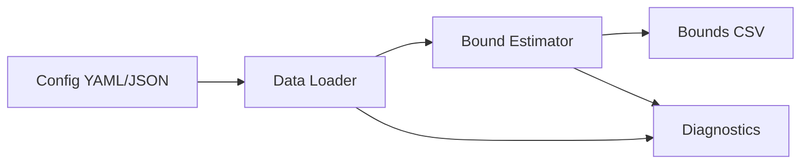

# Information-Theoretic Causal Bounds under Unmeasured Confounding

This repo implements the method in "Information-Theoretic Causal Bounds under Unmeasured Confounding (Jung & Kang, 2026)." It provides lower and upper bounds on causal estimands under unmeasured confounding without bounded outcomes, sensitivity parameters, instruments/proxies, or full SCM specification.

Target estimands (paper notation):

```
θ(a, x) = E_{Q_{a,x}}[φ(Y)],  Q_{a,x} = P(Y | do(A=a), X=x)
θ(a)    = E_{Q_a}[φ(Y)]
```

## Install (step-by-step, very detailed)

Below is a public, copy‑paste friendly guide. The key idea is that `pip install .` installs the package from the **current directory** (this repo) into your **currently active Python environment**.

### 0) Open a terminal and go to the repo root

You must run these commands **in the repository root** (the folder containing `pyproject.toml`).

If you haven’t cloned the repo yet:

```bash
git clone https://github.com/yonghanjung/Information-Theretic-Bounds.git
cd Information-Theretic-Bounds
```

If you already have the repo locally, just `cd` into it:

```bash
cd <your-local-repo-path>
```

Check you are in the right place:

```bash
ls pyproject.toml
```

If it prints `pyproject.toml`, you are in the correct directory.

### 1) Create and activate a clean virtual environment (recommended)

This keeps dependencies isolated to this project.

```bash
python -m venv .venv
```

Activate it:

```bash
source .venv/bin/activate  # macOS/Linux
```

On Windows (PowerShell):

```powershell
.venv\\Scripts\\Activate.ps1
```

On Windows (cmd.exe):

```bat
.venv\\Scripts\\activate.bat
```

After activation, your shell prompt usually shows `(.venv)`.

### 2) Upgrade pip inside the venv

```bash
python -m pip install --upgrade pip
```

### 3) Install this package from the repo directory

This installs **itbound** into the active environment.

```bash
python -m pip install .
```

What this means:
- `.` means “the current folder.”
- So `pip install .` tells pip to read `pyproject.toml` here and install the package.

### 4) (Optional) Development install (editable)

Use this if you want local code changes to be reflected immediately without reinstalling.

```bash
python -m pip install -e .
```

### 5) (Optional) Extras for figure reproduction

If you want to run the `reproduce` command and create figures:

```bash
python -m pip install '.[experiments]'
```

### 6) Quick sanity check

```bash
python -m itbound --help
```

If you see the CLI help output, the installation worked.

## 10-Minute Quickstart (Opt-in Wrapper)

`quick` is an opt-in wrapper around `itbound.fit(...)`; default math remains paper-equivalent (`mode=paper-default`).

```bash
python -m venv .venv && source .venv/bin/activate
python -m pip install --upgrade pip
python -m pip install .
python -m itbound example --out /tmp/itbound_example.csv
python -m itbound quick --data /tmp/itbound_example.csv --treatment a --outcome y --covariates x1,x2 --outdir /tmp/itbound_quick
```

What the outputs mean:
- `lower`/`upper`: robust causal bound endpoints, not a single identified point estimate.
- `width = upper - lower`: interval uncertainty under the allowed confounding set.
- `valid_interval`: whether each row has a finite valid interval after domain/validity checks.

Artifact location:
- All quick outputs are written under `--outdir` (for example `/tmp/itbound_quick`).
- Expected files: `summary.txt`, `results.json`, `claims.json`, `claims.md`, `plots/`, optional `report.html`.
- Details: [`docs/quickstart.md`](docs/quickstart.md), [`docs/artifact_contract.md`](docs/artifact_contract.md), schema [`docs/results_schema_v0.md`](docs/results_schema_v0.md).

## Python API

New wrapper (recommended):

```python
import itbound
```

Standard-library function:

```python
from itbound.standard import run_standard_bounds

result = run_standard_bounds(
    csv_path="/tmp/itbound_toy.csv",
    outcome_col="y",
    treatment_col="a",
    covariate_cols=["x1", "x2"],
    divergences=["KL", "JS", "Hellinger", "TV", "Chi2"],
    aggregation_mode="paper_adaptive_k",
    outdir="/tmp/itbound_standard",
    write_html=True,
)
```

Legacy import (still supported):

```python
import fbound
```

## CLI

### Run bounds from config

```bash
itbound run --config docs/cli-config.example.yaml
```

You can override output path:

```bash
itbound run --config docs/cli-config.example.yaml --out /tmp/itbound_bounds.csv
```

### Run a quick synthetic example

```bash
itbound example --out /tmp/itbound_example.csv
```

### Reproduce arXiv plots

```bash
itbound reproduce --dry-run
```

Notes:
- `reproduce` expects the final-arxiv JSON summaries under `experiments/final-arxiv`.
- If you installed the package, run `itbound reproduce` from the repo root so the data files are found.
- Install extras first: `pip install .[experiments]`.

### Standard-library run (CSV -> bounds + claims JSON + plots + optional HTML)

```bash
itbound standard \
  --csv /tmp/itbound_toy.csv \
  --y-col y \
  --a-col a \
  --x-cols x1,x2 \
  --outdir /tmp/itbound_standard \
  --divergences KL,JS,Hellinger,TV,Chi2 \
  --aggregation-mode paper_adaptive_k \
  --html
```

Aggregation modes:
- `paper_adaptive_k` (default): increase endpoint-k until feasible interval is found.
- `fixed_k_endpoint`: use exactly `--fixed-k` for both endpoints.
- `tight_kth`: experiment-style tight-kth aggregation (starts from large k, relaxes down).
  - default divergences for this mode are the same built-in 5: `KL,JS,Hellinger,TV,Chi2`.
  - you can override to a subset with `--divergences` (for example `KL,TV`).

Ground-truth plot overlay options (visualization only; math unchanged):
- `--ground-truth-col <col>`: draw per-row truth values from a column.
- `--ground-truth-effect <float>`: draw a scalar horizontal truth line.
- `--no-ground-truth-auto`: disable auto detection from `mu1-mu0`.
- default behavior auto-detects `mu1-mu0` when available.

Example (`tight_kth`):

```bash
itbound standard \
  --csv /tmp/itbound_toy.csv \
  --y-col y \
  --a-col a \
  --x-cols x1,x2 \
  --outdir /tmp/itbound_standard_tight \
  --aggregation-mode tight_kth
```

Example (`tight_kth` subset override + explicit truth column):

```bash
itbound standard \
  --csv /tmp/itbound_toy.csv \
  --y-col y \
  --a-col a \
  --x-cols x1,x2 \
  --outdir /tmp/itbound_standard_tight_kltv \
  --divergences KL,TV \
  --aggregation-mode tight_kth \
  --ground-truth-col tau_true
```

Artifacts written to `--outdir`:
- `bounds.csv`
- `summary.json` (claims + diagnostics + run config)
- plot PNGs when `matplotlib` is available
- `report.html` when `--html` is enabled

If `matplotlib` is missing, plotting is skipped with a warning and other artifacts are still produced.
See also: [`docs/aggregation_modes.md`](docs/aggregation_modes.md)

### Artifact Contract Run (schema-versioned `results.json`)

```bash
itbound artifacts \
  --csv /tmp/itbound_toy.csv \
  --y-col y \
  --a-col a \
  --x-cols x1,x2 \
  --outdir /tmp/itbound_artifacts \
  --divergences KL
```

This opt-in command writes a fixed folder contract:
- `summary.txt`
- `results.json` (schema versioned; see `docs/results_schema_v0.md`)
- `claims.json`
- `claims.md`
- `plots/`
- `report.html` (optional with `--html`)

### Quick Wrapper Run (`itbound.fit` via CLI)

```bash
itbound quick \
  --data /tmp/itbound_toy.csv \
  --treatment a \
  --outcome y \
  --covariates x1,x2 \
  --outdir /tmp/itbound_quick
```

`quick` is an opt-in wrapper around `itbound.fit(...)` with default `mode=paper-default`,
and writes the same artifact contract (`summary.txt`, `results.json`, `claims.json`, `claims.md`, `plots/`).

### Live Demo (Toy + Benchmark)

IHDP scenario preview (GIF rendered from the actual CLI run):


Run a fast IHDP demo with explicit KL + truth-coverage envelope:

```bash
itbound demo --scenario ihdp --divergence KL --enforce-truth-coverage --eval-points 240 --rounds 5 --n-folds 5 --outdir /tmp/itbound_live_demo --batch-size 8
```

Run on a benchmark-style IHDP CSV:

```bash
itbound demo --scenario ihdp --ihdp-data /path/to/ihdp_npci_1.csv --divergence KL --enforce-truth-coverage --eval-points 240 --rounds 5 --n-folds 5 --outdir /tmp/itbound_live_demo --batch-size 8
```

Run both in one command:

```bash
itbound demo --scenario both --toy-n 1000 --divergence KL --enforce-truth-coverage --eval-points 240 --rounds 5 --n-folds 5 --outdir /tmp/itbound_live_demo --batch-size 8
```

The demo writes per-scenario artifact folders (`toy/`, `ihdp/`) plus `live_demo_summary.md` under `--outdir`.
By default, IHDP plots use a demo-only truth-aware envelope so every point satisfies `lower < truth < upper` visually.
Use `--no-enforce-truth-coverage` to disable this visualization aid.
Use `--eval-points` (e.g., `240`) to render fewer evaluation points for smoother, less spiky demo plots.

To regenerate the GIF:

```bash
bash scripts/demo/make_quick_demo.sh
```

## Good Example (End-to-End)

Install, run a quick example, and verify the output columns:

```bash
pip install .
itbound example --out /tmp/itbound_example.csv

python - <<'PY'
import pandas as pd
df = pd.read_csv("/tmp/itbound_example.csv")
print(df.columns.tolist())
PY
```

Expected columns include `lower` and `upper`.

## Example Diagram



## Example Plot


## Config schema (CLI)

The config must be YAML or JSON and include:

- `data`: one of `synthetic`, `npz_path`, or `csv_path`
- `divergence`
- `propensity_model`
- `m_model`
- `dual_net_config`
- `fit_config`
- `seed`

Optional:
- `phi` (default: `identity`)
- `output_path` (default: `itbound_bounds.csv`)

See `docs/cli-config.example.yaml` for a complete example.

For a full field-by-field explanation, see `docs/config.md`.

## Toy CSV example

Create a toy CSV and run:

```bash
python - <<'PY'
import numpy as np
import pandas as pd

rng = np.random.default_rng(0)
n = 50
x1 = rng.normal(size=n)
x2 = rng.normal(size=n)
a = (x1 + rng.normal(scale=0.5, size=n) > 0).astype(int)
y = 1.0 + 0.5 * a + 0.3 * x1 - 0.2 * x2 + rng.normal(scale=0.1, size=n)

df = pd.DataFrame({"y": y, "a": a, "x1": x1, "x2": x2})
df.to_csv("/tmp/itbound_toy.csv", index=False)
print("/tmp/itbound_toy.csv")
PY

cat <<'YAML' > /tmp/itbound_toy.yaml
data:
  csv_path: /tmp/itbound_toy.csv
  y_col: y
  a_col: a
  x_cols: [x1, x2]
divergence: KL
phi: identity
propensity_model: logistic
m_model: linear
dual_net_config:
  hidden_sizes: [8, 8]
  activation: relu
  dropout: 0.0
  h_clip: 10.0
  device: cpu
fit_config:
  n_folds: 2
  num_epochs: 2
  batch_size: 16
  lr: 0.005
  weight_decay: 0.0
  max_grad_norm: 5.0
  eps_propensity: 0.001
  deterministic_torch: true
  train_m_on_fold: true
  propensity_config:
    C: 1.0
    max_iter: 200
    penalty: l2
    solver: lbfgs
    n_jobs: 1
  m_config:
    alpha: 1.0
  verbose: false
  log_every: 1
seed: 123
YAML

itbound run --config /tmp/itbound_toy.yaml --out /tmp/itbound_toy_bounds.csv
```

## Agent Skill

Agent-friendly usage is documented in `docs/agent/SKILL.md`.

## Theory at a glance (ITB.pdf)

### Divergence bound from propensity (Theorem 1)

For any action `a` and covariates `x` with `P(a|x) > 0`:

```
D_f(P_{a,x} || Q_{a,x}) <= B_f(e_a(x)),  B_f(e) = e f(1/e) + (1-e) f(0)
```

This upper bound depends only on the propensity score, making the divergence radius fully propensity-score-based.

Specializations used in the code:
- `KL`: `D_KL(P||Q) <= -log e`
- `Hellinger`: `D_H(P||Q) <= 1 - sqrt(e)`
- `Chi2`: `D_chi2(P||Q) <= (1-e)/(2e)`
- `TV`: `D_TV(P||Q) <= 1 - e`
- `JS`: `D_JS(P||Q) <= B_fJS(e)` (closed form in the paper)

### Dual causal bound (Theorem 2)

Define `g(s)=s f(1/s)` and its convex conjugate `g*(t)`. The upper bound solves:

```
θ_up(a,x) = inf_{λ>0, u in R} { λ η_f(a,x) + u + λ E_{P_{a,x}}[g*((φ(Y)-u)/λ)] }
```

### Debiased semiparametric estimator (Section 5)

The code minimizes the paper's risk function (Definition 4) with cross-fitting and a Neyman-orthogonal correction, using:
- PyTorch dual nets for `h(a,x)` and `u(a,x)` with `λ(a,x)=exp(h(a,x))`
- sklearn propensity + outcome regressors for nuisances

## Diagnostics (AGENTS P0)

Endpoint-wise aggregation reports per-point diagnostics:
- `n_eff_up`, `n_eff_lo`: effective candidate counts after filtering.
- `k_used_up`, `k_used_lo`: order-statistic index used (default 1).
- `invalid_up`, `invalid_lo`, `nonfinite_upper`, `nonfinite_lower`, `inverted_filtered`: rejection counts.

Run example outputs include validity masks and these diagnostics in the saved tables.
